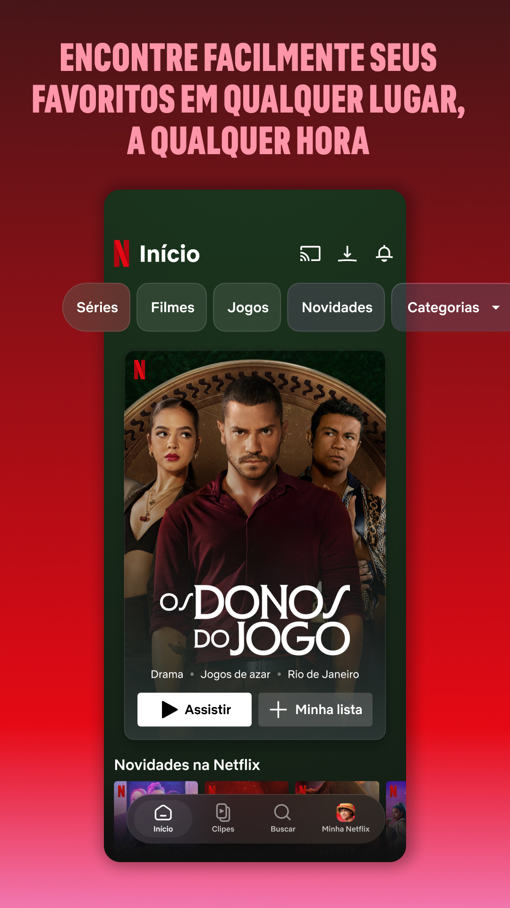
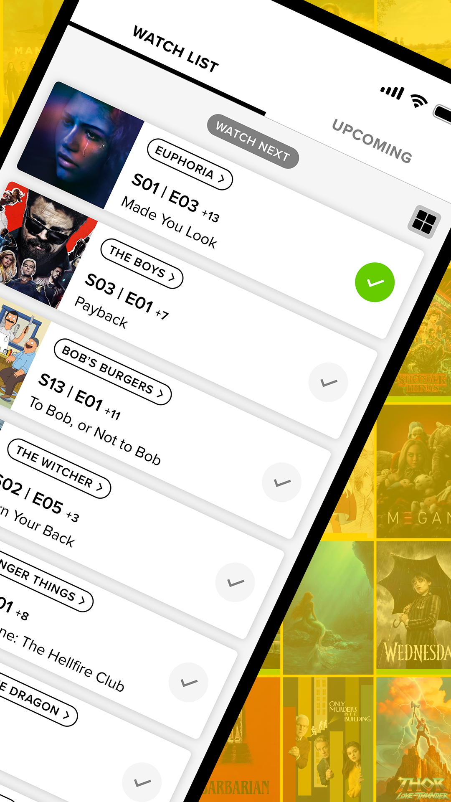
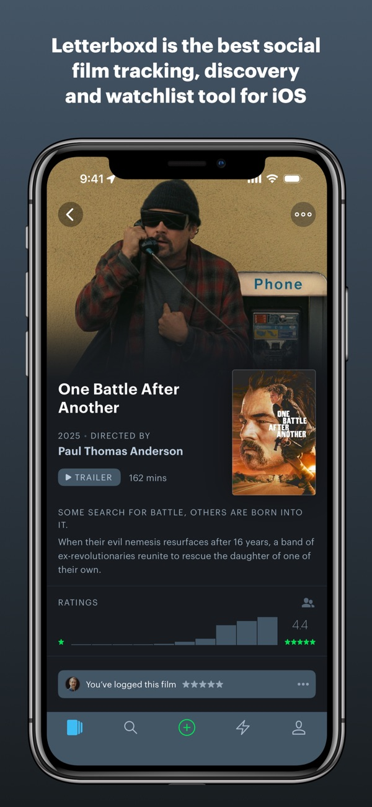

# References — Maratona

## 1. Objetivo

As referências abaixo orientam as decisões de experiência e interface.

## 2. Referência 01 — Netflix

### Fonte
App Netflix, captura de tela oficial da página na Google Play Store: https://play.google.com/store/apps/details?id=com.netflix.mediaclient

### Imagem

### O que observamos?
A tela inicial abre com um título em destaque ocupando boa parte da tela: imagem grande, nome, gêneros e dois botões de ação ("Assistir" e "Minha lista"). Logo abaixo começam as fileiras horizontais por categoria ("Novidades na Netflix").

### O que vamos aproveitar?
O destaque grande no topo, com poucas informações e uma ação principal, seguido de carrosséis horizontais de pôsteres.

### Como será adaptado?
O `HeroBanner` da Home mostra a série mais em alta da semana, com nota, ano, sinopse e o botão "Ver série". O componente `SeriesRow` monta os carrosséis "Em alta", "Populares" e "Mais bem avaliadas". Para ficar mais minimalista, trocamos o fundo vermelho da Netflix por um fundo quase preto e usamos o degradê escuro sobre a imagem.

## 3. Referência 02 — TV Time

### Fonte
App TV Time (encerrado em julho de 2026), captura de tela oficial que estava na Google Play Store: https://play.google.com/store/apps/details?id=com.tozelabs.tvshowtime

### Imagem

### O que observamos?
A "Watch list" mostra, para cada série, o próximo episódio a assistir (por exemplo "S03 | E01 Payback") e quantos faltam (+7). Cada linha tem um botão de check circular que fica verde quando o episódio é marcado.

### O que vamos aproveitar?
O check circular por episódio e a ideia de mostrar o próximo episódio de cada série em uma lista única.

### Como será adaptado?
O `EpisodeItem` tem um botão circular que fica preenchido com a cor de destaque (dourado) e anima com um "pop" quando o episódio é marcado. A página "Minhas séries" mostra "Próximo: T_ E_" com link direto para a temporada, além de uma barra de progresso no lugar do contador "+7".

## 4. Referência 03 — Letterboxd

### Fonte
App Letterboxd, captura de tela oficial da App Store: https://apps.apple.com/br/app/letterboxd/id1054271011

### Imagem

### O que observamos?
A página de um título usa a imagem da cena (backdrop) no topo, que se funde com o fundo escuro. O pôster fica ao lado do nome, e as informações (ano, duração, sinopse) aparecem em texto discreto, com pouca decoração em volta.

### O que vamos aproveitar?
O fundo escuro neutro, o backdrop que se funde com a página e o pôster ao lado das informações.

### Como será adaptado?
A página `SeriesDetails` usa o backdrop da série com degradê até o fundo `#0b0b0f`, o pôster à esquerda e as informações (nota, ano, temporadas, gêneros) em "chips" discretos. Usamos uma única cor de destaque, o dourado `#e8b04b`, que lembra a iluminação de cinema. Os títulos usam a fonte Bebas Neue (estilo letreiro de cinema) e o corpo usa Inter.
